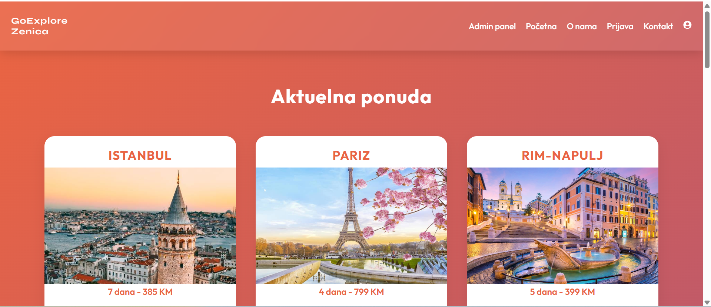

**Turistička agencija GoExplore Zenica- Web aplikacija**

**Opis teme**

Ovaj projekat predstavlja web aplikaciju turističke agencije "GoExplore" smještene u Zenici.
Cilj aplikacije je omogućiti korisnicima jednostavan pregled ponuda putovanja, rezervaciju aranžmana i kontakt s agencijom.
Korisnici na stranici mogu pregledati sve dostupne destinacije zajedno sa slikama, cijenama, dostupnim terminima i kratkim opisima. Klikom na pojedinu ponudu otvara se modal s detaljnijim informacijama o odabranoj destinaciji.
Da bi izvršili rezervaciju, korisnici se moraju ulogovati – a ako nemaju nalog, mogu se registrovati putem forme za registraciju.
Aplikacija sadrži i više dodatnih stranica:
1. O nama – kratak opis agencije, njene misije i vizije, informacije o tome šta putovanja uključuju, a šta ne, te osnovne statističke brojke (broj putovanja, zadovoljnih klijenata i sl.).
2. Kontakt stranica – sadrži formu za slanje poruka, iframe s prikazom lokacije agencije, radno vrijeme, linkove ka društvenim mrežama, kao i email adresu i broj telefona.
3. Korisnici u navigaciji (navbaru) ne vide admin panel osim ako imaju administratorske privilegije.
U administrativnom panelu admin može: pregledati sve rezervacije korisnika, dodavati i brisati destinacije.
Aplikacija koristi lokalnu bazu podataka (db.json) za čuvanje informacija o korisnicima, destinacijama i rezervacijama.

**Tehnologije korištene u radu**
1. React.js (biblioteka za izradu interaktivnog korisničkog sučelja i upravljanje komponentama)
2. CSS (stiliziranje stranica i komponenti)
3. JSON (format za pohranu i razmjenu podataka; koristi se za mock podatke i rad s JSON serverom)
4. React Router (upravljanje navigacijom i više stranica unutar aplikacije bez ponovnog učitavanja)
5. JSON Server (alat za brzo postavljanje lažnog REST API-ja za razvoj i testiranje backend funkcionalnosti)
6. Node.js & npm (Node.js za pokretanje JavaScript koda lokalno, npm za instalaciju potrebnih paketa projekta).

**Opis strukture projekta**
Root:
- db.json

src/
  Components/
    - Destinacije.js
    - Footer.js
    ...
  Pages/
    - AdminPanel.js
    - Kontakt.js
    ...
  - App.css
  - App.js
  - README.md
  ...

public/
  images/ (slike za Ponudu i db.json)
  screenshots/ (snimci radne aplikacije)
  favicon.ico, index.html, manifest.json...

**Funkcionalnosti i opis dizajna**
Dizajn se temelji na modernom i responzivnom korisničkom interfejsu. Korišten je fleksibilan raspored (flex i grid layout) koji omogućava uredan prikaz elemenata na desktop i mobilnim uređajima.

Glavne funkcionalnosti:
1. Responzivnost: dizajn se prilagođava ekranima manjih dimenzija
2. Navigacija: header sadrži navigacijsku traku (navbar) s pristupom svim stranicama
3. Početna stranica: pozadinska slika s tamnim slojem i centralno pozicioniranim tekstom i dugmetom poziva na akciju
4. Sekcije i kartice imaju sjene, zaobljene ivice i animacije za dinamičan izgled
5. Modalni prozor: koristi poluprozirnu pozadinu i blur efekat za prezentaciju sadržaja u iskačućem prozoru
6. Forme: elementi imaju focus efekte i vizuelne povratne informacije prilikom unosa podataka
7. Footer: bijeli tekst na gradijentnoj pozadini

Paleta boja:
1. #e96443 primarna boja (pozadinski gradijent, naslovi, dugmad, hover efekti)
2. #904e95 sekundarna boja (pozadinski gradijent, ikone, naglašeni elementi)
3. #fff (tekst i pozadine nekih sekcija)
4. #444 (tekst unutar svijetlih sekcija)
5. #0077cc (dugme na admin panelu)
6. prozirni slojevi i sjene (rgba bijela ili crna boja)

Fontovi:
1. 'Outfit',sans-serif (osnovni font za tijelo)
2. 'Syne',sans-serif (za logotip i naslove)

**Uloge korisnika**
Postoje dvije glavne uloge korisnika: Admin i Guest. Svaka uloga ima različita prava pristupa i funkcionalnosti u aplikaciji.
1. Guest: može pregledati ponudu destinacija, može napraviti rezervaciju, može vidjeti svoje podatke na stranici profil.js, u navbaru ne vidi opciju AdminPanel pa ne može ni pristupiti toj stranici
2. Admin: u navbaru vidi opciju AdminPanel i jedini ima pristup toj stranici, ima pregled svih rezervacija korisnika, može dodavati i brisati destinacije, može vidjeti sve funckionalnosti dostupne guest korisnicima
Neprijavljeni korisnik može samo pregledati ponudu, ali ne može izvršiti rezervaciju niti pristupiti računu.

**Uputa za pokretanje projekta**
1. Klonirajte repozitorij s GitHub-a (git clone)
2. Instalirajte potrebne pakete (u cmd ili Terminalu se prebacite u folder projekta ili gdje ste klonirali repozitorij, te pokrenite instalaciju: npm install)
3. Pokrenite JSON server za backend (u cmd ili Terminalu unesite: "npx json-server --watch db.json --port 5000" i server će biti dostupan na http://localhost:5000 )
4. Pokrenite projekat u razvojnom režimu (u cmd ili Terminalu unesite "npm install", aplikacija će se otvoriti u pregledniku na adresi http://localhost:3000)

**Snimci ekrana radne aplikacije**

1. Početna stranica:

2. Ponuda:

3. Stranica O nama:

4. Prijava:

5. Registracija:

6. Kontakt stranica:

7. Prikaz prijavljenog korisnika:

8. Admin panel - prikaz rezervacija:

9. Admin panel - dodavanje, brisanje i prikaz destinacija:

10. Izgled stranice na manjim ekranima:

